Linux Workstation
=================

This chapter explain the installation of Linux Distribution on local storage.
You can also decide to use Linux within a Virtual Machine (or a container) installed on Windows.
This last case is not currently described in this chapter.

Download ISO
------------

This document is based on [**Ubuntu GNOME**](https://ubuntugnome.org/) **16.04 LTS** **64 bits**, other distro can be installed based on this tutorial.

* Download link: http://cdimage.ubuntu.com/ubuntu-gnome/releases/16.04/release/
* Select the latest 16.04.x 64 bits
* During the download continue with next steps.

Download network certificate
----------------------------

Your comapny may use 802.1x authentication.
As IT teams does not often support Linux Workstation,
the network settings requires manually configuration.

Use the Windows session to download the certificate file `network-ca.pem`.

Create a partition for Linux
----------------------------

To install a Linux Distribution in dual boot with Windows, first create a free partition on local storage (Hard disk or SSD).

As illustrated with the following picture, go to **Démarrer** → **Ordinateur** → Context menu (mouse right click) → **Gérer**

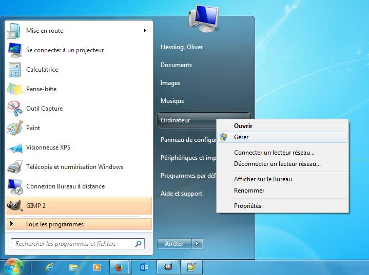

Continue to **Gestion de l'ordinateur** → **Gestion des disques** → Context menu on OSDisk (C:) → **Réduire le volume...** and select the minimal amount for Windows.

Before reducing Windows partition, the storage may be cleaned and compress: **Gestion de l'ordinateur** → **Gestion des disques** → Context menu on OSDisk (C:) → **Propriétés**

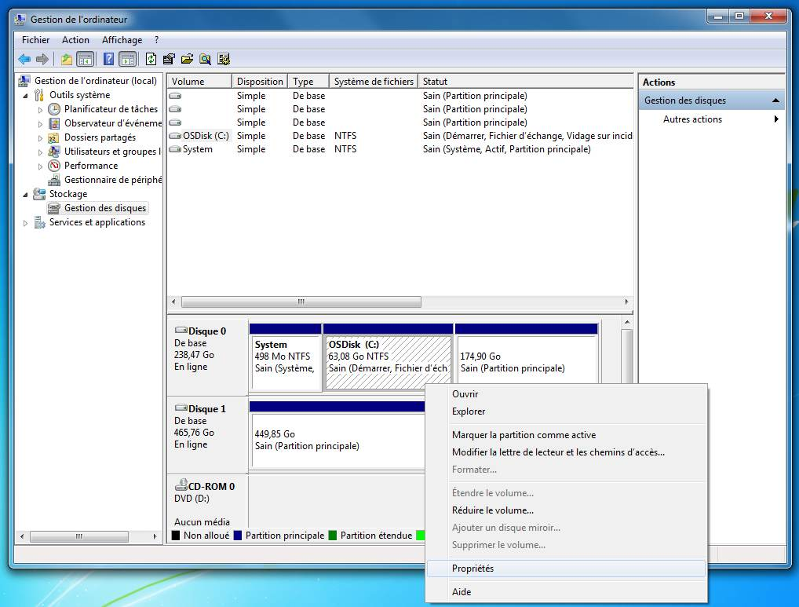

On proprety dialog box, use **Nettoyage de disque** and **Compresser ce lecteur pour augmenter l'espace disponible**.

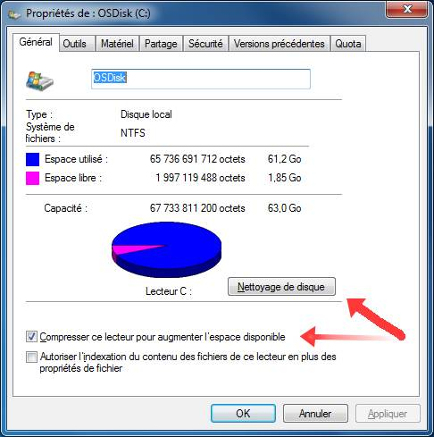

Windows reserve local storage space to hibernate.
Disable this feature to reduce deeper the partition _OSDisk_.

Before downloading big files and installing applications, the partition _OSDisk_ can be reduced below 50 GB.

Disable Paging File
===================

The [**paging file**](https://en.wikipedia.org/wiki/Paging) in Windows corresponds to the swap partition in Linux.
Removing this file may save many gigabytes within the file-system but doing so may change Windows behaviour when you boot this OS later.
Follow the below procedure (and dialog box illustrations) to disable/remove this paging file.

1. From main Windows bar: Start → Computer → Context menu (mouse right click) → Properties → Change settings  
   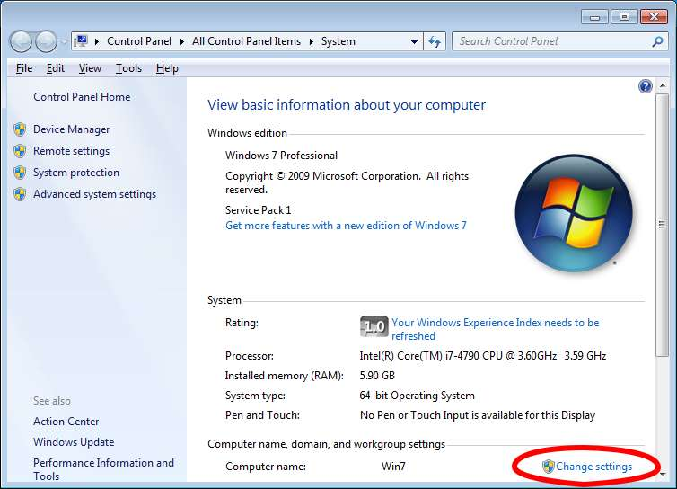
2. Dialog box "System Properties": Advanced → Settings...  
   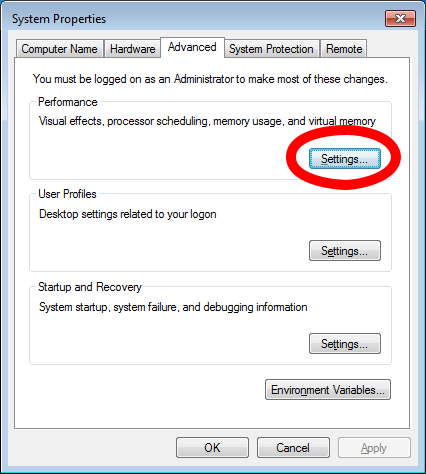
3. Dialog box "Performance Options": Advanced → Change...  
   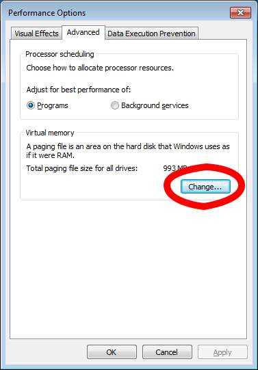
4. Dialog box "Virtual Memory": Un-check "Automatically manage paging file size for all drives",  
   then select "No paging file" and validate with button "Set".  
   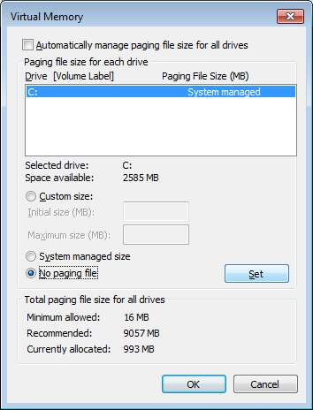

Connection to network
=====================

If the network uses 802.1x authentication and
automatic network configuration does not not support Linux Workstation,
the network settings requires manually configuration.

Configuration based on Network-Manager
--------------------------------------

/!\ Bug Ubuntu Unity

This configuration does not work on **Ubuntu Unity 16.04** (bug on 802.1x support)

Please install rather  **Ubuntu GNOME 16.04** (Gnome3) and change later the Desktop Interface.

1.  Download certificat `network-ca.pem`

2.  Enter Wired Settings

    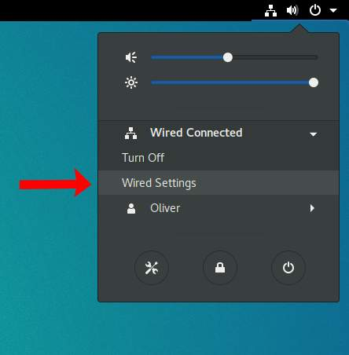
    
3. Enter configuration panel

   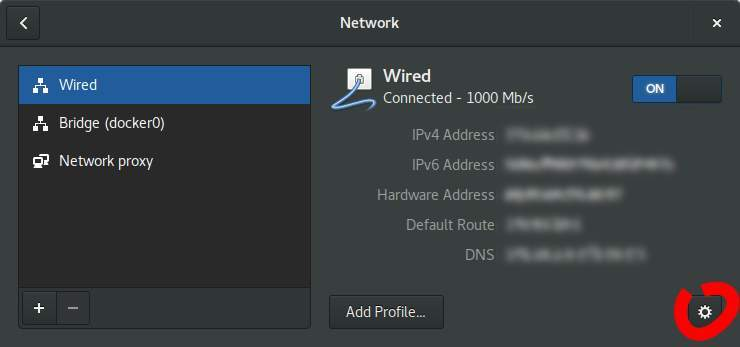
   
4. Dans l'onglet **Security**

    1.  Activer 802.1x
    2.  Authentification : Protected EAP (PEAP)
    3.  Anonymous identity : laisser vide
    4.  CA certificate : le certificat récupéré à l'étape 1
    5.  PEAP version : automatique
    6.  Inner authentication : MSCHAPv2
    7.  Username : login Windows
    8.  Password : mot de passe Windows

5. Cliquer sur "Apply"

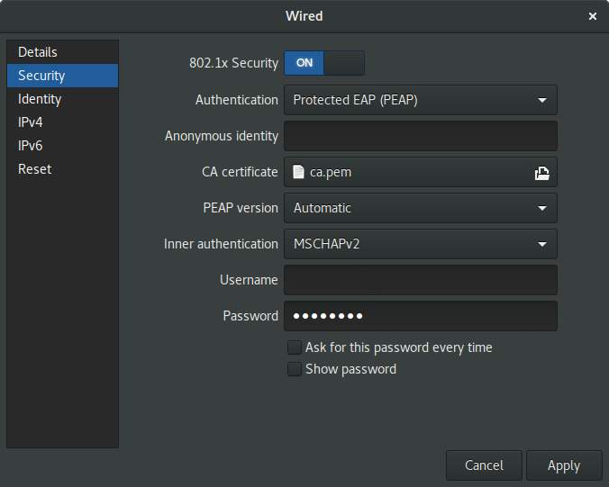

Configuration sans Network-Manager
----------------------------------

Il est possible de se passer de Network-Manager et d'utiliser directement `wpa_supplicant` pour réaliser l'authentification.

Récupérer le certificat ercom comme indiqué dans la procédure pour NetworkManager.

Il suffit ensuite de créer un fichier de configuration avec le contenu suivant :

**WPA supplicant**

    ctrl_interface=/var/run/wpa_supplicant
    ctrl_interface_group=0
    eapol_version=1
    ap_scan=0
    network {
      key_mgmt=IEEE8021X
      eap=PEAP
      phase2="auth=MSCHAPV2"
      identity="login Windows" (prénom.nom)
      password="mot de passe Windows"
      ca_cert="chemin vers le certificat network-ca.pem"
      eapol_flags=0
    }

On peut ensuite lancer wpa_supplicant :

    $ wpa_supplicant -d -i interface_réseau -D wired -c chemin_vers_fichier_de_config_ci_dessus

Il ne reste plus qu'à utiliser un client dhcp pour obtenir une adresse. Par exemple avec dhcpcd

    $ dhcpcd interface_réseau

e-mail, contacts and calendar
=============================

E-mail infrastructure often use Exchange and Outlook.
There is no Linux version of Outlook so another way to access mails has to be used.

Webmail
-------

Microsoft Exchange provides a Webapp.

Thunderbird
-----------

Thunderbird can access the exchange server through an IMAP bridge created by a locally running IMAP server.

    $ sudo apt install thunderbird

Setup your mail account like this:

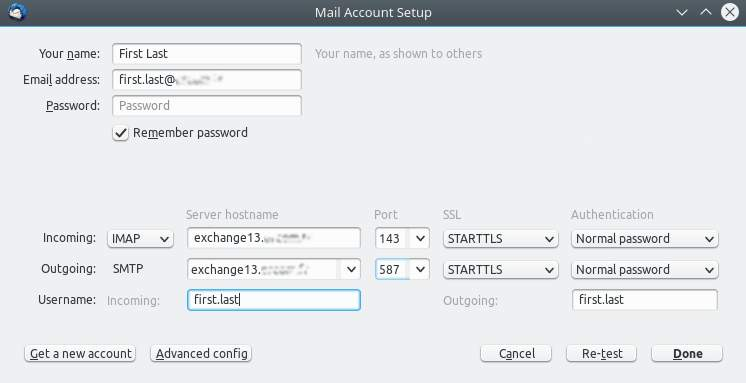

There is a bug: the outgoing server will be automatically detected as **kerberos-based**.
Go to Outgoing Server (SMTP) and change the authentication method to **Normal pasword**.

You now have incoming and outgoing emails!

### Address book linked to the Active Directory

1. Go to the address book

2. Create a new LDAP directory

   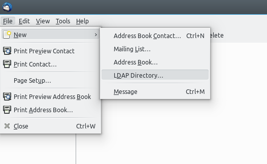
   
3. Fill the properties like this:
    * Hostname: IP adress
    * Base DN:  ou=mycompany,dc=mycompany-net,dc=local
    * Port number: 3268
    * Bind DN: MYCOMPANY-NET\firstname.lastname

    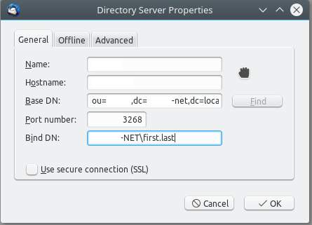

4. Edit the preferences

    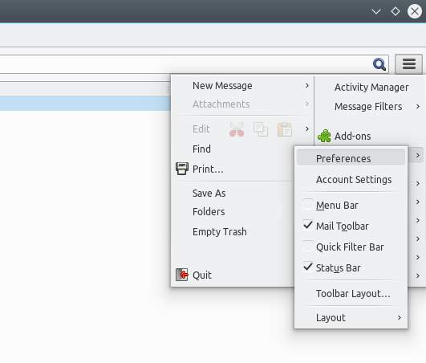

5. Select the LDAP directory

    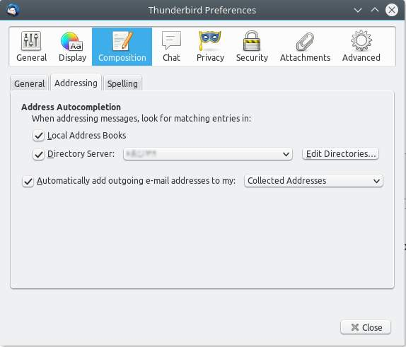

### Lightning (Thunderbird Calendar add-on)

    $ sudo apt install xul-ext-lightning

or by using the Add-ons manager page from Thunderbird (see http://www.heber.it/?p=170#anchor_1)

/!\ TODO Cette configuration ne semble pas fonctionner :-/

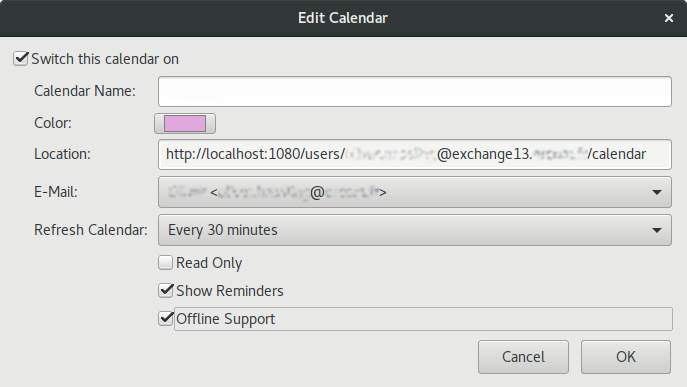

### DavMail

DavMail is not really necessary if IMAP/SMTP extension are available on the your Microsoft Exchange server.

$ sudo apt install davmail

or download from http://sourceforge.net/projects/davmail/files/davmail/

1.  Manually start davmail. If the GUI failed to start, do a right click on the taskbar icon and select _"settings"_.

2.  Enter the exchange server URL In the field **"OWA (Exchange) URL"**

    ![]img/DavMailGatewaySettings.jpg)

Printer
=======

1.  Go to "Settings"

2.  Select "Printers"

3.  Click on the "+" to add a printer

     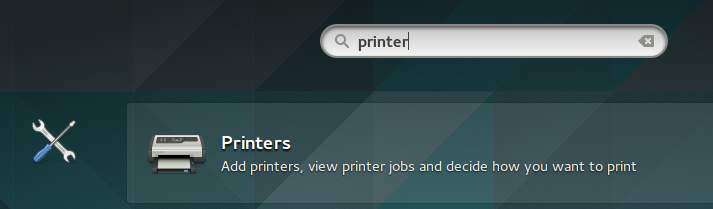
     
4. Enter the network IP of your printer

5. Choose **LPD-Printer**, then "Add"

    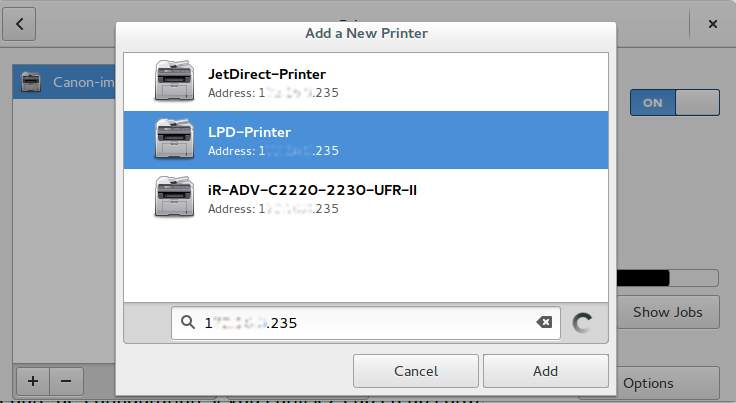
    
6. For example choose **Canon ImageRunner C2550 Foomatic/pxlcolor** (see [askubuntu.com/q/274426](https://askubuntu.com/q/274426/)), then "Select".  
   Be carefully if you select the wrong driver, the _Print Test Page_ may print continuously and empty your paper tray.
   
    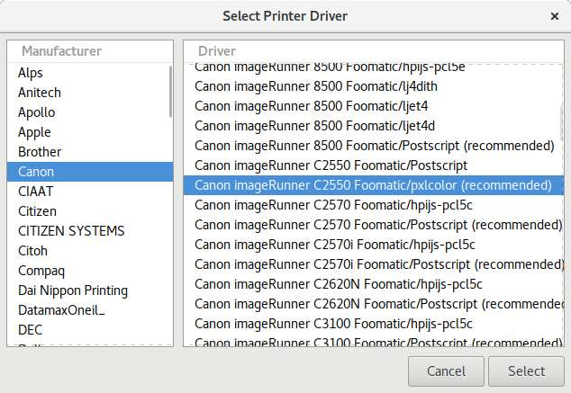
    
    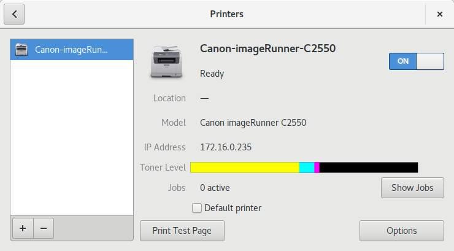

Docker
======

This section documents Docker 1.9.

    $ sudo apt-get install apt-transport-https ca-certificates

Add docker repository and install docker

    sudo apt-key adv --keyserver hkp://ha.pool.sks-keyservers.net:80 --recv-keys 58118E89F3A912897C070ADBF76221572C52609D
    echo "deb http://apt.dockerproject.org/repo ubuntu-wily main | sudo tee /etc/apt/source.list.d/docker.list
    sudo apt update
    sudo apt install docker-engine=1.9.1-0~wily
    sudo apt-mark hold docker-engine # apt must not update this package

Ubuntu Make
===========

If you use Ubuntu, you can use **[ubuntu-make](https://wiki.ubuntu.com/ubuntu-make)** to install latest versions of IDEs.

1. Install **ubuntu-make**
--------------------------

Install the latest version:

    sudo add-apt-repository ppa:ubuntu-desktop/ubuntu-make
    sudo apt update
    sudo apt install ubuntu-make

2. Find your favorite software
------------------------------

To list available software use one of these commands:

    umake --help
    man umake
    info umake

3. Install your IDE
-------------------

Some examples :

    umake android android-studio
    umake android android-sdk
    umake android android-ndk
    
    umake ide eclipse
    umake ide eclipse-cpp
    umake ide netbeans
    umake ide idea
    
    umake ide atom
    umake ide sublime-text
    umake ide visual-studio-code
    
    umake go
    umake rust

Some downloading may take many minutes. It's time to take a coféée or be patient.

4. Update
---------

Keep your favorite developer environment on latest versions:

    sudo apt update
    sudo apt full-upgrade

No top left hot corner
======================

When the cursor reaches the top left corner, GNOME 3 displays the overview of current running windows.
This can be annoying and can be disabled installing this GNOME extension:
https://extensions.gnome.org/extension/118/no-topleft-hot-corner/

`zsh`
=====

[`zsh`](http://fr.wikipedia.org/wiki/Z_Shell) is a shell alternative to `bash` providing many improvements.

    sudo apt-get install zsh  # install
    zsh                       # switch to zsh
    chsh -s  /bin/zsh         # set zsh as the default shell

Oh-my-zsh
---------

Oh-my-zsh is a set of scripts extending `zsh` (themes, plugin system and other nice tricks).

    curl -L http://install.ohmyz.sh | sh  # install
    vim ~/.zshrc                          # customize

Suggested plugins:

    plugins=(git fasd cp colorized colored-man compleat copyfiles copydir extract screen debian)

* Plugin details: https://github.com/robbyrussell/oh-my-zsh/wiki/Plugins-Overview
* Cheatsheet: https://github.com/robbyrussell/oh-my-zsh/wiki/Cheatsheet

The git plugin of oh-my-zsh constantly monitors the current state of your repo (through a git status command) to display a small symbol on your command line. This behavior can slow down the terminal.
To solve this issue, add the following to your `.zshrc` file:

    function git_prompt_info() {
      ref=$(git symbolic-ref HEAD 2> /dev/null) || return
      echo "$ZSH_THEME_GIT_PROMPT_PREFIX${ref#refs/heads/}$ZSH_THEME_GIT_PROMPT_SUFFIX"
    }

Fasd
----

http://github.com/clvv/fasd

Fasd is a small utility enabling fast navigation through a unix filesystem.
Fasd analyzes the directories and files you visit, and allows to quickly reach a previously visited file or directory.
Fasd is efficient with zsh and oh-my-zsh.

    wget https://github.com/clvv/fasd/archive/master.zip
    unzip master.zip
    cd fasd-master`
    cmake .
    sudo make install

i3
==

https://i3wm.org/

i3 is a powerful tiling window manager that can be controlled entirely with the keyboard (also supports the mouse).
It avoid any loss of space and speeds up the navigation between windows.

    sudo apt install i3

To launch it, on the ubuntu login select the i3 window manager on the small white circle near the login.

VirtualBox
==========

VirtualBox is a Virtual Machine Monitor (hypervisor) running on Windows/Linux/Mac.
For example, VirtualBox can:

* Host a Windows VM on Linux
* Host a Linux VM on Windows

Installation
------------

* Windows: https://www.virtualbox.org/wiki/Downloads
* Linux

        sudo apt install virtualbox

Guest-Additions
---------------

The **Guest-Additions** improves the user experience: drag-and-drop and better mouse integration.
You do not need to install it because it is now part of a the default installation.

Extension Pack
--------------

The VirtualBox [Extension Pack](https://en.wikipedia.org/wiki/VirtualBox#VirtualBox_Extension_Pack) implements the USB 2 & 3 and Remote Desktop protocols. But its end-user license ([PUEL](https://www.virtualbox.org/wiki/VirtualBox_PUEL)) forbids free professional use (only commercial license).

Please do **NOT** install it because you may not need USB 2 & 3 and Remote Desktop protocols.

Tips
----

* Increase the size of a disk image see [http://superuser.com/a/1147292/112297](http://superuser.com/a/1147292/112297).
* To access network from a VM you may need to set VM network in **NAT** mode and run the following command from host:

        VBoxManage modifyvm "VM name" --natdnshostresolver1 on

* Reduce the size of a VirtualBox filesystem (extension `*.vdi`)
    1. Nullify the free space
        * Linux guest
    
              sudo dd if=/dev/zero of=/deleteme bs=4M; sudo rm /deleteme
            
        * Windows guest (download SDelete: http://technet.microsoft.com/en-us/sysinternals/bb897443)
    
              sdelete.exe C: -z

    2. Shutdown the guest VM            
    3. Compact the disk file
        * Linux host
    
              vboxmanage modifyhd <path_to_disk.vdi> --compact
            
        * Windows guest (download SDelete: http://technet.microsoft.com/en-us/sysinternals/bb897443)
    
              "C:\Program Files\Oracle\VirtualBox\VBoxManage.exe" modifyhd <path_to_disk.vdi> --compact
